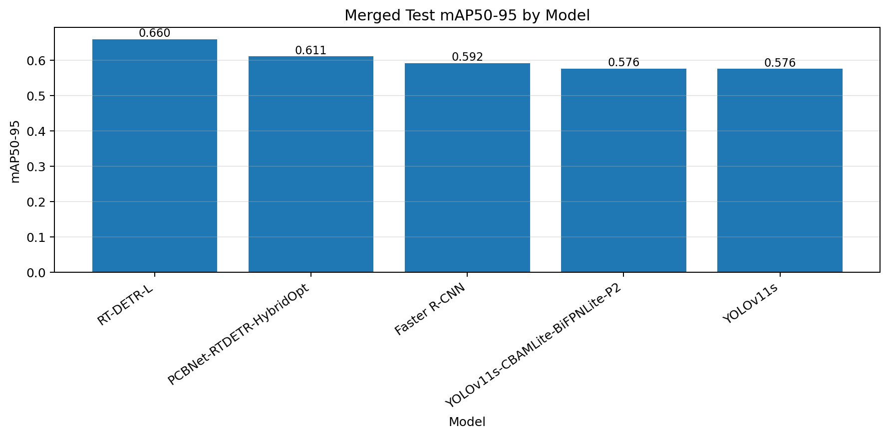
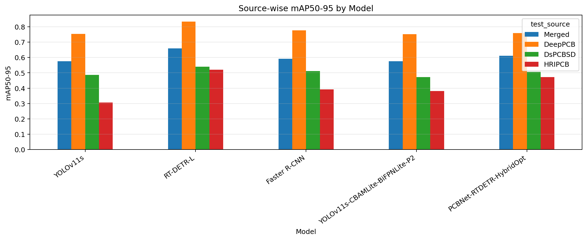
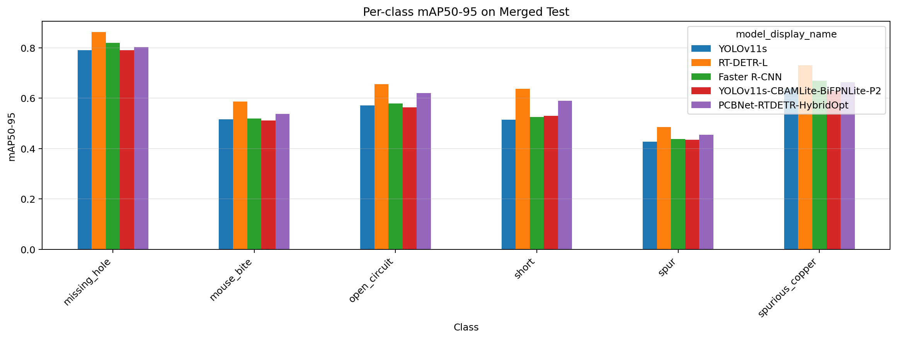
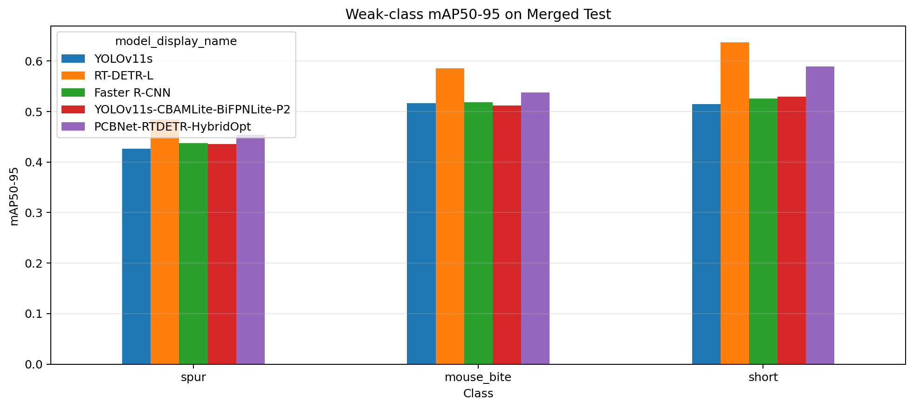

# PCB Defect Detection Benchmark

A source-wise benchmark for printed circuit board (PCB) defect detection using a cleaned 6-class merged dataset, multiple object detection families, and an additional public-safe Semi-DETR research summary.

This project focuses on four goals:

1. Build a clean and consistent 6-class PCB defect dataset.
2. Benchmark multiple detector families under the same data protocol.
3. Analyze whether weak performance comes from model choice, class difficulty, or dataset-source/domain differences.
4. Document additional Semi-DETR-style semi-supervised detection research while respecting private-data confidentiality.

---

## Overview

PCB defect detection is challenging because defects are often small, low-contrast, and visually similar to normal copper traces or neighboring defect categories. This project evaluates multiple detection approaches on a merged PCB dataset and reports both merged-test performance and source-wise performance.

The final dataset is named:

```text
DataPCB_Final_Clean_6cls
```

The six target classes are:

```text
missing_hole
mouse_bite
open_circuit
short
spur
spurious_copper
```

---

## Dataset

The project uses three PCB defect datasets as raw sources:

```text
DeepPCB
DsPCBSD
HRIPCB
```

The final processed dataset standardizes class names and label ids across sources, removes unsupported DsPCBSD classes, and keeps a consistent YOLO detection format.

### Final Class Set

| ID | Class |
|---:|---|
| 0 | missing_hole |
| 1 | mouse_bite |
| 2 | open_circuit |
| 3 | short |
| 4 | spur |
| 5 | spurious_copper |

### Data Strategy

The final dataset uses a clean 6-class standardization strategy:

- Map common PCB defect categories into one shared class set.
- Remove unsupported DsPCBSD classes that are not shared by the other sources.
- Remove invalid/empty labels after class filtering.
- Preserve the original train/valid/test split structure.
- Avoid hard class balancing after experiments showed that count balancing alone did not solve per-class detection difficulty.

The project treats remaining weakness in `spur`, `mouse_bite`, and related small defects as a model/data difficulty problem rather than a simple class-count imbalance problem.

---

## Benchmark Design

All models are trained on the merged training split and evaluated on:

```text
Merged test
DeepPCB test only
DsPCBSD test only
HRIPCB test only
```

This source-wise evaluation checks whether a model is generally robust or whether performance is being dominated by one dataset source.

---

## Models

The benchmark includes five main detection models:

| Notebook | Model | Role |
|---|---|---|
| `02_train_yolov11s_datapcb_clean_6cls_sourcewise.ipynb` | YOLOv11s | one-stage baseline |
| `03_train_rtdetr_l_datapcb_clean_6cls_sourcewise.ipynb` | RT-DETR-L | transformer-based baseline |
| `04_train_faster_rcnn_datapcb_clean_6cls_sourcewise.ipynb` | Faster R-CNN ResNet50-FPN | two-stage detector baseline |
| `05_train_yolov11s_cbamlite_bifpnlite_p2_datapcb_clean_6cls_sourcewise.ipynb` | YOLOv11s + CBAMLite + BiFPNLite + P2 | custom small-object-oriented YOLO variant |
| `06_train_pcbnet_rtdetr_hybridopt_datapcb_clean_6cls_sourcewise.ipynb` | PCBNet-RTDETR-HybridOpt | RT-DETR optimization experiment |

### Model Notes

- **YOLOv11s** is used as the practical one-stage baseline.
- **RT-DETR-L** represents a stronger transformer-based detector.
- **Faster R-CNN** provides a classical two-stage comparison.
- **YOLOv11s + CBAMLite + BiFPNLite + P2** tests whether attention, lightweight feature fusion, and a P2 detection head can improve small-defect classes.
- **PCBNet-RTDETR-HybridOpt** keeps the RT-DETR-L architecture but changes the training/optimization recipe, including higher input resolution and AdamW/cosine-style optimization.

---

## Benchmark Results

The final comparison notebook is:

```text
notebooks/07_compare_sourcewise_benchmark_results.ipynb
```

It reads source-wise CSV files from:

```text
reports/tables/
```

and generates consolidated tables and figures.

### Overall Comparison on Merged Test Set

| Model | Precision | Recall | F1 | mAP50 | mAP50-95 | FPS |
|---|---:|---:|---:|---:|---:|---:|
| YOLOv11s | 0.8529 | 0.8053 | 0.8285 | 0.8788 | 0.5761 | 90.7908 |
| RT-DETR-L | 0.9215 | 0.8970 | 0.9090 | 0.9315 | 0.6595 | 23.7442 |
| Faster R-CNN | 0.7823 | 0.9004 | 0.8372 | 0.8924 | 0.5918 | 11.2345 |
| YOLOv11s-CBAMLite-BiFPNLite-P2 | 0.8428 | 0.8146 | 0.8284 | 0.8818 | 0.5764 | 61.0634 |
| PCBNet-RTDETR-HybridOpt | 0.8945 | 0.8767 | 0.8855 | 0.9177 | 0.6112 | 20.9106 |

### Best Model per Source

| Test Source | Best Model | mAP50-95 | mAP50 | Precision | Recall |
|---|---|---:|---:|---:|---:|
| Merged | RT-DETR-L | 0.6595 | 0.9315 | 0.9215 | 0.8970 |
| DeepPCB | RT-DETR-L | 0.8345 | 0.9862 | 0.9875 | 0.9705 |
| DsPCBSD | RT-DETR-L | 0.5399 | 0.8699 | 0.8594 | 0.8404 |
| HRIPCB | RT-DETR-L | 0.5198 | 0.9613 | 0.9742 | 0.9507 |

### Best Model per Class on Merged Test

| Class | Best Model | mAP50-95 |
|---|---|---:|
| missing_hole | RT-DETR-L | 0.8618 |
| mouse_bite | RT-DETR-L | 0.5861 |
| open_circuit | RT-DETR-L | 0.6556 |
| short | RT-DETR-L | 0.6376 |
| spur | RT-DETR-L | 0.4847 |
| spurious_copper | RT-DETR-L | 0.7314 |

---

## Result Figures

### Merged-test mAP50-95 by Model



### Source-wise mAP50-95 by Model



### Per-class mAP50-95 on Merged Test



### Weak-class Focus



---

## Key Findings

### 1. RT-DETR-L is the strongest overall model

RT-DETR-L achieves the best merged-test performance:

```text
mAP50    = 0.9315
mAP50-95 = 0.6595
Precision = 0.9215
Recall    = 0.8970
```

It is also the best model on every source-specific test subset: Merged, DeepPCB, DsPCBSD, and HRIPCB. This suggests that transformer-based detection is the most robust option among the tested models for this dataset.

### 2. YOLOv11s is the fastest practical baseline

YOLOv11s reaches:

```text
FPS      = 90.7908
mAP50-95 = 0.5761
```

It is substantially faster than RT-DETR-L, but its accuracy is lower. This makes YOLOv11s a useful speed-oriented baseline, but not the best-performing detector in this benchmark.

### 3. The custom YOLOv11s-P2 variant did not provide meaningful improvement

YOLOv11s + CBAMLite + BiFPNLite + P2 achieves:

```text
mAP50-95 = 0.5764
FPS      = 61.0634
```

Compared with stock YOLOv11s:

```text
YOLOv11s mAP50-95    = 0.5761
Custom YOLO mAP50-95 = 0.5764
```

The improvement is negligible, while inference speed drops from about 90.79 FPS to 61.06 FPS. Based on this result, the added CBAMLite/BiFPNLite/P2 complexity is not justified in its current combined form.

### 4. Faster R-CNN improves recall but remains slower

Faster R-CNN achieves:

```text
Recall   = 0.9004
mAP50-95 = 0.5918
FPS      = 11.2345
```

It has strong recall, but lower precision and much lower FPS than YOLOv11s. It is useful as a two-stage detector comparison, but it is not the best choice for this benchmark.

### 5. PCBNet-RTDETR-HybridOpt did not beat stock RT-DETR-L

PCBNet-RTDETR-HybridOpt achieves:

```text
mAP50-95 = 0.6112
FPS      = 20.9106
```

This is better than YOLOv11s and Faster R-CNN in mAP50-95, but lower than stock RT-DETR-L. The result suggests that the current HybridOpt recipe does not improve over the standard RT-DETR-L training setup.

### 6. Spur remains the hardest class

On the merged test set, RT-DETR-L is the best model for every class. However, `spur` remains the weakest class:

```text
spur mAP50-95 = 0.4847
```

This supports the hypothesis that the main bottleneck is not simple class-count imbalance, but class-level visual difficulty, localization sensitivity, or source/domain-specific annotation differences.

---

## Main Benchmark Conclusion

The strongest model in this benchmark is **RT-DETR-L**. It achieves the best merged-test mAP50-95 and is also the best model on DeepPCB, DsPCBSD, and HRIPCB source-specific test sets.

The main practical conclusions are:

- **Best accuracy:** RT-DETR-L
- **Best speed:** YOLOv11s
- **Best two-stage comparison:** Faster R-CNN
- **Custom YOLO-P2 result:** not meaningfully better than YOLOv11s
- **HybridOpt result:** not better than stock RT-DETR-L
- **Hardest class:** spur
- **Most important next step:** error analysis for `spur`, `mouse_bite`, and source-specific failure cases

---

## Additional Semi-Supervised DETR Research

I also studied a Semi-DETR-style semi-supervised object detection pipeline on a private academic PCB defect dataset.

The public-safe notebooks are available under:

```text
notebooks/semidetr/
```

The experiments include:

- supervised Deformable DETR baseline,
- vanilla DETR-SSOD baseline,
- DETR-SSOD + SHM,
- Semi-DETR ablation with SHM + CQC,
- full Semi-DETR-style SHM + CQC + CPM.

The original dataset, visual samples, checkpoints, prediction files, and raw training outputs are not public due to confidentiality constraints.

A technical summary is available at:

```text
docs/semidetr_private_research_summary.md
```

### Semi-DETR Summary

The Semi-DETR experiments compare supervised and semi-supervised DETR-style detectors under limited labeled-data settings:

```text
5% labeled data
10% labeled data
```

Public-safe high-level results:

| Label Ratio | Best Method | Test AP | Gain vs Sup-only |
|---|---|---:|---:|
| 5% | DETR-SSOD + SHM | 0.5621 | +0.0199 |
| 10% | Full SHM+CQC+CPM | 0.6211 | +0.0204 |

The 5% setting suggests that SHM is most useful when labeled data is extremely limited. The 10% setting suggests that the full Semi-DETR-style configuration becomes more beneficial when enough labeled signal is available to stabilize pseudo-label control.

All Semi-DETR notebooks committed to this repository should remain sanitized and output-free.

---

## Repository Structure

```text
pcb-defect-detection-benchmark/
├── README.md
├── requirements.txt
├── configs/
│   └── data/
│       ├── kaggle_datapcb_final_clean_6cls.yaml
│       └── local_datapcb_final_clean_6cls.example.yaml
├── data/
│   └── README.md
├── docs/
│   ├── experiment_log.md
│   ├── kaggle_links.md
│   └── semidetr_private_research_summary.md
├── notebooks/
│   ├── 01_prepare_final_datapcb_clean_6cls.ipynb
│   ├── 02_train_yolov11s_datapcb_clean_6cls_sourcewise.ipynb
│   ├── 03_train_rtdetr_l_datapcb_clean_6cls_sourcewise.ipynb
│   ├── 04_train_faster_rcnn_datapcb_clean_6cls_sourcewise.ipynb
│   ├── 05_train_yolov11s_cbamlite_bifpnlite_p2_datapcb_clean_6cls_sourcewise.ipynb
│   ├── 06_train_pcbnet_rtdetr_hybridopt_datapcb_clean_6cls_sourcewise.ipynb
│   ├── 07_compare_sourcewise_benchmark_results.ipynb
│   └── semidetr/
│       ├── 01_semidetr_data_audit_public_sanitized.ipynb
│       ├── 02_supervised_deformable_detr_ratio10_public_sanitized.ipynb
│       ├── 03_vanilla_detr_ssod_ratio10_public_sanitized.ipynb
│       ├── 04_detr_ssod_shm_ratio10_public_sanitized.ipynb
│       ├── 05_semidetr_shm_cqc_ablation_ratio10_public_sanitized.ipynb
│       ├── 06_semidetr_shm_cqc_cpm_full_ratio10_public_sanitized.ipynb
│       └── 07_semidetr_summary_public_sanitized.ipynb
└── reports/
    ├── tables/
    ├── figures/
    └── benchmark_readme_summary.md
```

---

## Reproducibility

### Environment

Training was performed on Kaggle GPU notebooks.

Install the Python dependencies:

```bash
pip install -r requirements.txt
```

The main experiments use:

```text
Python
PyTorch
Ultralytics
TorchVision
TorchMetrics
OpenCV
Pandas
Matplotlib
```

### Kaggle Workflow

This project follows a Kaggle-based workflow:

```text
GitHub = documentation, notebooks, result summaries
Kaggle = training environment, full outputs, logs, checkpoints, and weights
```

The full training outputs are not committed to GitHub. Kaggle notebook links should be listed in:

```text
docs/kaggle_links.md
```

### Data Paths

The processed dataset path on Kaggle is expected to be similar to:

```text
/kaggle/input/datasets/<owner>/pcb-merged/DataPCB_Final_Clean_6cls
```

The notebooks copy the dataset to:

```text
/kaggle/working/DataPCB_Final_Clean_6cls
```

before training. This avoids read-only cache issues from `/kaggle/input`.

---

## How to Run

### 1. Prepare the dataset

Run:

```text
notebooks/01_prepare_final_datapcb_clean_6cls.ipynb
```

This creates the cleaned 6-class dataset.

### 2. Train the main benchmark models

Run the training notebooks:

```text
notebooks/02_train_yolov11s_datapcb_clean_6cls_sourcewise.ipynb
notebooks/03_train_rtdetr_l_datapcb_clean_6cls_sourcewise.ipynb
notebooks/04_train_faster_rcnn_datapcb_clean_6cls_sourcewise.ipynb
notebooks/05_train_yolov11s_cbamlite_bifpnlite_p2_datapcb_clean_6cls_sourcewise.ipynb
notebooks/06_train_pcbnet_rtdetr_hybridopt_datapcb_clean_6cls_sourcewise.ipynb
```

Each training notebook exports source-wise result CSV files.

### 3. Collect result CSV/PNG files

Download the small result files from Kaggle output and place them in:

```text
reports/tables/
reports/figures/
```

Do not commit weights, checkpoints, or full run folders.

### 4. Generate the benchmark summary

Run:

```text
notebooks/07_compare_sourcewise_benchmark_results.ipynb
```

This generates final comparison tables, figures, and a README helper file:

```text
reports/benchmark_readme_summary.md
```

### 5. Review the Semi-DETR research summary

Open:

```text
docs/semidetr_private_research_summary.md
```

The Semi-DETR notebooks under `notebooks/semidetr/` are public-safe sanitized notebooks. They should remain cleared of output before committing.

---

## What Is Not Committed

The repository intentionally excludes:

```text
data/raw/
data/processed/
runs/
weights/
*.pt
*.pth
*.zip
```

Large datasets, full training outputs, and model weights should remain on Kaggle or local storage.

For private Semi-DETR research, the following are also excluded:

```text
private dataset
raw images
visual samples
prediction grids
confusion matrix images
model checkpoints
teacher/student weights
prediction JSON files
full training outputs
raw Kaggle outputs
```

---

## Notes for Reviewers

This repository is intended to demonstrate:

- practical dataset cleaning for object detection,
- YOLO-format data preparation,
- benchmark design across multiple detector families,
- source-wise evaluation,
- per-class and weak-class analysis,
- custom architecture experimentation,
- semi-supervised DETR-style research experience,
- careful handling of private data and large training artifacts.

For full training logs and downloadable Kaggle outputs, see:

```text
docs/kaggle_links.md
```
