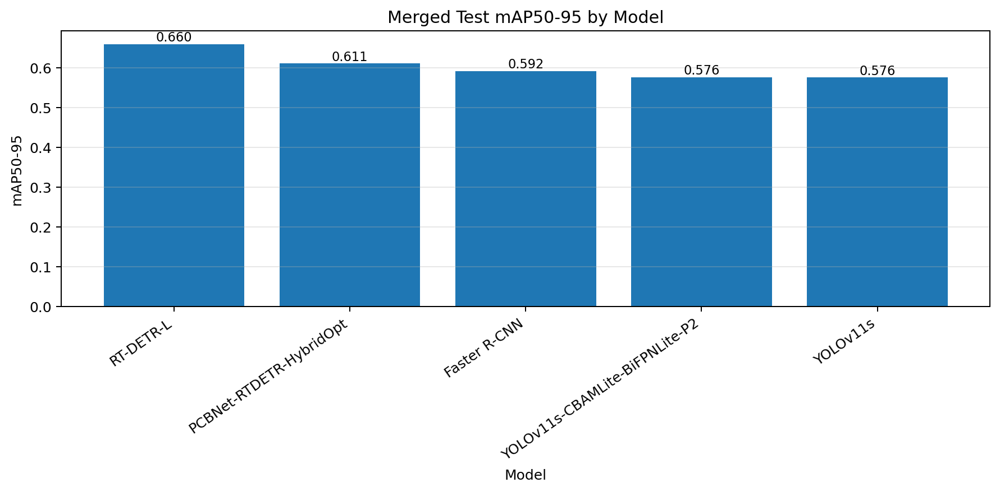
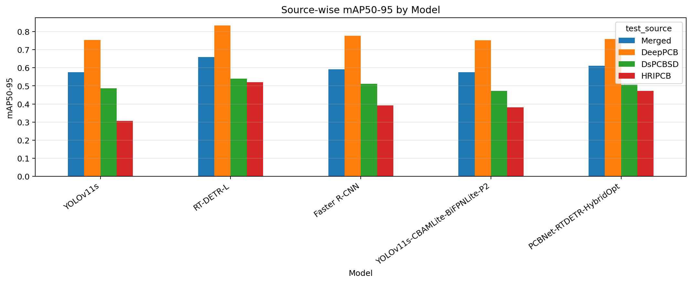
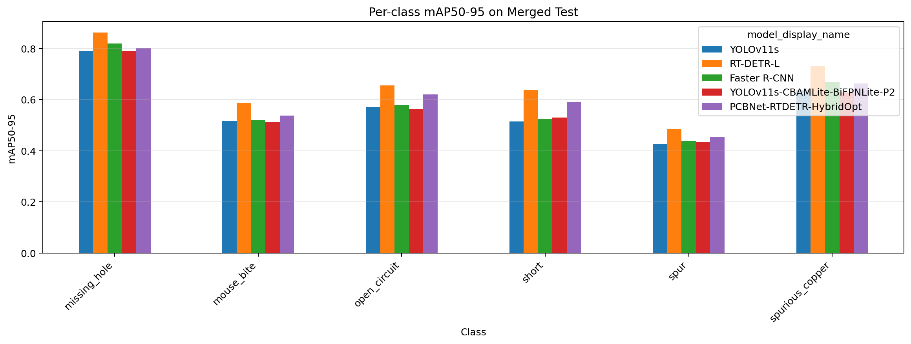
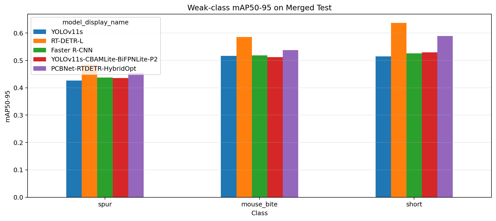

# PCB Defect Detection Benchmark

A source-wise benchmark for printed circuit board (PCB) defect detection using a cleaned 6-class merged dataset and multiple object detection families.

This project focuses on building a reproducible PCB defect detection benchmark, comparing one-stage, two-stage, and transformer-based detectors, and analyzing model robustness across different PCB dataset sources.

## Highlights

* Built a cleaned 6-class PCB defect dataset from DeepPCB, DsPCBSD, and HRIPCB.
* Standardized class names, label IDs, and YOLO detection format across multiple dataset sources.
* Benchmarked YOLOv11s, RT-DETR-L, Faster R-CNN ResNet50-FPN, YOLOv11s-CBAMLite-BiFPNLite-P2, and PCBNet-RTDETR-HybridOpt.
* Evaluated models on merged and source-specific test sets to analyze domain robustness.
* Best merged-test model: RT-DETR-L with `0.9315 mAP50` and `0.6595 mAP50-95`.
* Highest recorded evaluation throughput: YOLOv11s with `90.79 FPS` in the original notebook logs; this was not a standardized cross-framework latency test.
* Added result tables, figures, source-wise evaluation, and a public-disclosure summary of a separate confidential-data Semi-DETR study.

## Problem Statement

PCB defect detection is difficult because many defects are:

* small
* low-contrast
* visually similar to normal copper traces
* visually similar to neighboring defect classes
* unevenly distributed across dataset sources

A single merged-test score can hide source-specific failure cases. Therefore, this project evaluates each detector on both the merged test set and individual source-specific test sets.

## Dataset

The project uses three PCB defect datasets as raw sources:

```text
DeepPCB
DsPCBSD
HRIPCB
```

The final processed dataset is:

```text
DataPCB_Final_Clean_6cls
```

The final benchmark dataset uses a consistent YOLO detection format:

```text
data/processed/DataPCB_Final_Clean_6cls/
```

Dataset files are excluded from GitHub through `.gitignore`.

### Data Access

Dataset archives are not committed to this repository because they are large.

The public dataset archives can be downloaded from:

```text
https://drive.google.com/drive/folders/1HgYeXju6ztRux0FNicaaQ8CKoi9qTl5g?usp=sharing
```

The Google Drive folder contains:

```text
DsPCBSD+.zip
HRIPCB.zip
DeepPCB.zip
DataPCB_Final_Clean_6cls.zip
```

For expected local directory structure and extraction notes, see:

```text
docs/docs_data_sources.md
```

## Final Class Set

| ID | Class           |
| -: | --------------- |
|  0 | missing_hole    |
|  1 | mouse_bite      |
|  2 | open_circuit    |
|  3 | short           |
|  4 | spur            |
|  5 | spurious_copper |

## Data Strategy

The final dataset uses a clean 6-class standardization strategy:

* Map common PCB defect categories into one shared class set.
* Remove unsupported DsPCBSD classes that are not shared by the other sources.
* Remove invalid or empty labels after class filtering.
* Preserve the original train/valid/test split structure.
* Avoid hard class balancing after experiments showed that count balancing alone did not solve per-class detection difficulty.

Remaining weakness in `spur`, `mouse_bite`, and related small defects is treated as a model/data difficulty problem rather than a simple class-count imbalance problem.

## Benchmark Design

All models are trained on the merged training split and evaluated on:

```text
Merged test
DeepPCB test only
DsPCBSD test only
HRIPCB test only
```

This source-wise evaluation checks whether a model is generally robust or whether performance is dominated by one dataset source.

## Models

The benchmark includes five main detection models.

| Notebook                                                                      | Model                                | Role                               |
| ----------------------------------------------------------------------------- | ------------------------------------ | ---------------------------------- |
| `02_train_yolov11s_datapcb_clean_6cls_sourcewise.ipynb`                       | YOLOv11s                             | One-stage baseline                 |
| `03_train_rtdetr_l_datapcb_clean_6cls_sourcewise.ipynb`                       | RT-DETR-L                            | Transformer-based detector         |
| `04_train_faster_rcnn_datapcb_clean_6cls_sourcewise.ipynb`                    | Faster R-CNN ResNet50-FPN            | Two-stage baseline                 |
| `05_train_yolov11s_cbamlite_bifpnlite_p2_datapcb_clean_6cls_sourcewise.ipynb` | YOLOv11s + CBAMLite + BiFPNLite + P2 | Small-object-oriented YOLO variant |
| `06_train_pcbnet_rtdetr_hybridopt_datapcb_clean_6cls_sourcewise.ipynb`        | PCBNet-RTDETR-HybridOpt              | RT-DETR optimization experiment    |

### Model Notes

* **YOLOv11s** is used as the practical one-stage speed baseline.
* **RT-DETR-L** represents a stronger transformer-based detector.
* **Faster R-CNN ResNet50-FPN** provides a classical two-stage comparison.
* **YOLOv11s + CBAMLite + BiFPNLite + P2** tests whether attention, lightweight feature fusion, and a P2 detection head improve small-defect detection.
* **PCBNet-RTDETR-HybridOpt** keeps the RT-DETR-L architecture but modifies the optimization recipe, including higher input resolution and AdamW/cosine-style optimization.

## Benchmark Results

The final comparison notebook is:

```text
notebooks/07_compare_sourcewise_benchmark_results.ipynb
```

It reads source-wise CSV files from:

```text
reports/tables/
```

and generates consolidated tables and figures under:

```text
reports/figures/
```

### Overall Comparison on Merged Test Set

| Model                          | Precision | Recall |     F1 |  mAP50 | mAP50-95 | Recorded FPS* |
| ------------------------------ | --------: | -----: | -----: | -----: | -------: | ------: |
| YOLOv11s                       |    0.8529 | 0.8053 | 0.8285 | 0.8788 |   0.5761 | 90.7908 |
| RT-DETR-L                      |    0.9215 | 0.8970 | 0.9090 | 0.9315 |   0.6595 | 23.7442 |
| Faster R-CNN                   |    0.7823 | 0.9004 | 0.8372 | 0.8924 |   0.5918 | 11.2345 |
| YOLOv11s-CBAMLite-BiFPNLite-P2 |    0.8428 | 0.8146 | 0.8284 | 0.8818 |   0.5764 | 61.0634 |
| PCBNet-RTDETR-HybridOpt        |    0.8945 | 0.8767 | 0.8855 | 0.9177 |   0.6112 | 20.9106 |

\* `Recorded FPS` preserves the values emitted by the original notebooks. Batch size, device count, input size, runtime, and timed scope were not controlled across all models. See [`docs/benchmark_protocol.md`](docs/benchmark_protocol.md).

### Best Model per Source

| Test Source | Best Model | mAP50-95 |  mAP50 | Precision | Recall |
| ----------- | ---------- | -------: | -----: | --------: | -----: |
| Merged      | RT-DETR-L  |   0.6595 | 0.9315 |    0.9215 | 0.8970 |
| DeepPCB     | RT-DETR-L  |   0.8345 | 0.9862 |    0.9875 | 0.9705 |
| DsPCBSD     | RT-DETR-L  |   0.5399 | 0.8699 |    0.8594 | 0.8404 |
| HRIPCB      | RT-DETR-L  |   0.5198 | 0.9613 |    0.9742 | 0.9507 |

### Best Model per Class on Merged Test

| Class           | Best Model | mAP50-95 |
| --------------- | ---------- | -------: |
| missing_hole    | RT-DETR-L  |   0.8618 |
| mouse_bite      | RT-DETR-L  |   0.5861 |
| open_circuit    | RT-DETR-L  |   0.6556 |
| short           | RT-DETR-L  |   0.6376 |
| spur            | RT-DETR-L  |   0.4847 |
| spurious_copper | RT-DETR-L  |   0.7314 |

## Result Figures

### Merged-test mAP50-95 by Model



### Source-wise mAP50-95 by Model



### Per-class mAP50-95 on Merged Test



### Weak-class Focus



## Key Findings

### 1. RT-DETR-L is the strongest overall model

RT-DETR-L achieves the best merged-test performance:

```text
mAP50     = 0.9315
mAP50-95  = 0.6595
Precision = 0.9215
Recall    = 0.8970
Recorded FPS = 23.7442
```

It is also the best model on every source-specific test subset: Merged, DeepPCB, DsPCBSD, and HRIPCB. This suggests that transformer-based detection is the most robust option among the tested models for this dataset.

### 2. YOLOv11s has the highest recorded evaluation throughput

YOLOv11s reaches:

```text
Recorded FPS = 90.7908
mAP50     = 0.8788
mAP50-95  = 0.5761
```

It is substantially faster than RT-DETR-L, but its accuracy is lower. This makes YOLOv11s a useful speed-oriented baseline, but not the best-performing detector in this benchmark.

### 3. The custom YOLOv11s-P2 variant did not provide meaningful improvement

YOLOv11s + CBAMLite + BiFPNLite + P2 achieves:

```text
mAP50-95 = 0.5764
Recorded FPS = 61.0634
```

Compared with stock YOLOv11s:

```text
YOLOv11s mAP50-95    = 0.5761
Custom YOLO mAP50-95 = 0.5764
```

The mAP improvement is negligible. The original logs record `90.79 FPS` for stock YOLOv11s and `61.06 FPS` for this variant, but those runs used different evaluation batch/device settings. The speed gap is directional evidence, not a controlled latency comparison; the added complexity is not justified by the measured accuracy gain.

### 4. Faster R-CNN improves recall but remains slower

Faster R-CNN achieves:

```text
Recall    = 0.9004
mAP50     = 0.8924
mAP50-95  = 0.5918
Recorded FPS = 11.2345
```

It has strong recall and remains useful as a two-stage reference. Its historical timing used a broader evaluation-loop scope than the Ultralytics models, so a controlled latency run is required before drawing real-time deployment conclusions.

### 5. PCBNet-RTDETR-HybridOpt did not beat stock RT-DETR-L

PCBNet-RTDETR-HybridOpt achieves:

```text
mAP50     = 0.9177
mAP50-95  = 0.6112
Recorded FPS = 20.9106
```

Although it remains competitive, it does not outperform the stock RT-DETR-L baseline. This suggests that architecture-level changes or more targeted training strategies may be needed rather than only optimization-level adjustments.

### 6. Spur remains the hardest class

On the merged test set, `spur` remains the lowest-performing class even for the best model:

```text
Best spur mAP50-95 = 0.4847
Best model         = RT-DETR-L
```

This indicates that `spur` is likely difficult due to visual ambiguity, small defect size, and source-domain variation.

## Main Benchmark Conclusion

RT-DETR-L is the best overall model in this benchmark.

It provides the strongest merged-test performance, best source-wise robustness, and best per-class performance. YOLOv11s has the highest recorded throughput in the original logs, but deployment-speed selection requires the standardized protocol described in `docs/benchmark_protocol.md`.

The custom YOLOv11s-CBAMLite-BiFPNLite-P2 variant did not provide a meaningful improvement over stock YOLOv11s, and the PCBNet-RTDETR-HybridOpt experiment did not outperform stock RT-DETR-L.

## Additional Semi-Supervised DETR Research

This repository also includes a public-disclosure Semi-DETR research summary under:

```text
docs/semidetr_private_research_summary.md
```

The purpose of this document is to summarize additional semi-supervised detection research without exposing private training data or confidential project files.

This is a separate internal experiment on a confidential 5-class dataset. It is not part of the public 6-class benchmark above, and its AP values must not be compared directly with the public benchmark table. The notebooks make the implementation flow reviewable, but the reported internal results cannot be independently reproduced without the excluded dataset and artifacts.

### Semi-DETR Summary

Semi-DETR-style methods are relevant to PCB defect detection because labeled defect data is often limited and expensive to annotate.

The research summary discusses:

* pseudo-labeling
* DETR-style detection
* labeled/unlabeled data usage
* potential benefits for industrial defect detection
* confidentiality-aware reporting constraints

This section is included as additional research context, not as part of the main benchmark result. The numeric table in the research summary is explicitly labeled as reported internal evidence.

## Repository Structure

```text
pcb-defect-detection-benchmark/
│
├── configs/
│   ├── data/
│   └── experiments/
│
├── data/
│   ├── raw/
│   └── processed/
│
├── docs/
│   ├── benchmark_protocol.md
│   ├── docs_data_sources.md
│   ├── experiment_log.md
│   ├── kaggle_links.md
│   ├── reproducibility.md
│   └── semidetr_private_research_summary.md
│
├── notebooks/
│   ├── 01_prepare_final_datapcb_clean_6cls_sourcewise.ipynb
│   ├── 02_train_yolov11s_datapcb_clean_6cls_sourcewise.ipynb
│   ├── 03_train_rtdetr_l_datapcb_clean_6cls_sourcewise.ipynb
│   ├── 04_train_faster_rcnn_datapcb_clean_6cls_sourcewise.ipynb
│   ├── 05_train_yolov11s_cbamlite_bifpnlite_p2_datapcb_clean_6cls_sourcewise.ipynb
│   ├── 06_train_pcbnet_rtdetr_hybridopt_datapcb_clean_6cls_sourcewise.ipynb
│   ├── 07_compare_sourcewise_benchmark_results.ipynb
│   └── semidetr/
│
├── reports/
│   ├── figures/
│   ├── tables/
│   └── benchmark_readme_summary.md
│
├── scripts/
├── tests/
│
├── .gitignore
├── README.md
└── requirements.txt
```

## Reproducibility

### Environment

The historical core environment used Python `3.12.12`, PyTorch `2.10.0+cu128`, Torchvision `0.25.0+cu128`, and Ultralytics `8.4.30`. `requirements.txt` pins the corresponding core Python versions where supported, but it is not a complete lockfile.

Recommended review environment:

```text
Python 3.12
PyTorch
Ultralytics
OpenCV
Pandas
Matplotlib
Torchvision
```

Install dependencies:

```powershell
pip install -r requirements.txt
```

Run the offline checks before attempting training:

```powershell
python scripts\validate_reproducibility.py
python scripts\check_semidetr_public_safety.py
python -m unittest discover -s tests -v
```

These commands validate the committed experiment manifest, result provenance, timing arithmetic, Semi-DETR disclosure boundary, and regression tests without downloading data or using a GPU. See [`docs/reproducibility.md`](docs/reproducibility.md) for the exact scope and limitations.

### Kaggle Workflow

Heavy model training was performed on Kaggle.

Local machine is used mainly for:

* repository organization
* README/documentation
* notebook cleanup
* result table/figure storage

The public 6-class benchmark includes auditable notebooks, result artifacts, and a machine-readable historical experiment manifest. A full training rerun still requires the processed public-source dataset, model downloads, and compatible GPU resources. The confidential-data Semi-DETR results are code-auditable but not publicly data-reproducible.

### Data Paths

The final dataset path expected by the benchmark notebooks is:

```text
data/processed/DataPCB_Final_Clean_6cls/
```

The dataset YAML should point to:

```yaml
path: data/processed/DataPCB_Final_Clean_6cls
train: train/images
val: valid/images
test: test/images
nc: 6
names:
  - missing_hole
  - mouse_bite
  - open_circuit
  - short
  - spur
  - spurious_copper
```

## How to Run

### 1. Download the dataset archives

Download the dataset zip files from the Google Drive link in the Data Access section.

Expected archives:

```text
DsPCBSD+.zip
HRIPCB.zip
DeepPCB.zip
DataPCB_Final_Clean_6cls.zip
```

### 2. Prepare the dataset

Use the preparation notebook:

```text
notebooks/01_prepare_final_datapcb_clean_6cls_sourcewise.ipynb
```

This notebook prepares the final cleaned 6-class dataset and source-wise evaluation structure.

### 3. Train the benchmark models

Run the training notebooks:

```text
notebooks/02_train_yolov11s_datapcb_clean_6cls_sourcewise.ipynb
notebooks/03_train_rtdetr_l_datapcb_clean_6cls_sourcewise.ipynb
notebooks/04_train_faster_rcnn_datapcb_clean_6cls_sourcewise.ipynb
notebooks/05_train_yolov11s_cbamlite_bifpnlite_p2_datapcb_clean_6cls_sourcewise.ipynb
notebooks/06_train_pcbnet_rtdetr_hybridopt_datapcb_clean_6cls_sourcewise.ipynb
```

### 4. Collect result CSV/PNG files

Generated source-wise CSV files should be placed under:

```text
reports/tables/
```

Generated figures should be placed under:

```text
reports/figures/
```

### 5. Generate the benchmark summary

Run:

```text
notebooks/07_compare_sourcewise_benchmark_results.ipynb
```

This notebook creates consolidated benchmark tables and visualizations.

### 6. Review the Semi-DETR research summary

```text
docs/semidetr_private_research_summary.md
```

This document summarizes a separate confidential-data Semi-DETR study as a public-disclosure artifact. Before committing changes to its notebooks, run:

```powershell
python scripts\check_semidetr_public_safety.py
```

## What Is Not Committed

The following are intentionally excluded from Git:

```text
data/raw/
data/processed/
runs/
weights/
*.pt
*.pth
*.onnx
*.engine
*.zip
```

Large datasets, model weights, and training outputs should be stored externally through Kaggle, Google Drive, or other artifact storage.

## Git Tags / Milestones

Recommended milestone for this benchmark:

| Tag                         | Description                                      |
| --------------------------- | ------------------------------------------------ |
| `v0.1-sourcewise-benchmark` | Final source-wise PCB defect detection benchmark |

## Release Notes

Recommended release notes file:

```text
docs/release_notes_v0.1_benchmark.md
```

## Limitations

* The final benchmark is limited to the cleaned 6-class dataset.
* Performance may not generalize to unseen PCB manufacturing domains.
* Dataset source differences still affect performance.
* `spur`, `mouse_bite`, and similar small defects remain difficult.
* Class-count balancing alone did not solve weak-class performance.
* Custom architecture changes were tested only in limited forms.
* Heavy training was performed on Kaggle, not fully reproduced locally.
* Semi-DETR uses a separate confidential 5-class dataset; its reported results cannot be independently reproduced from this repository.
* Semi-DETR AP values are not directly comparable with the public 6-class benchmark results.

## Roadmap

Possible next steps:

1. Validate on more PCB datasets.
2. Add stronger augmentation ablation studies.
3. Test small-object-specific detectors more systematically.
4. Add semi-supervised learning experiments with unlabeled PCB images.
5. Add model export and inference demo.
6. Add a lightweight Streamlit or Gradio demo for inference visualization.
7. Compare deployment trade-offs between YOLOv11s and RT-DETR-L.

## CV Summary

Recommended CV project title:

```text
PCB Defect Detection Benchmark with YOLO, RT-DETR, and Faster R-CNN
```

Recommended CV bullets:

```text
- Built a source-wise PCB defect detection benchmark by cleaning and standardizing a merged 6-class dataset from DeepPCB, DsPCBSD, and HRIPCB into YOLO detection format.
- Benchmarked YOLOv11s, RT-DETR-L, Faster R-CNN ResNet50-FPN, and custom small-object-oriented detection variants across merged and source-specific test sets.
- Found RT-DETR-L achieved the best merged-test performance with 0.6595 mAP50-95 and 0.9315 mAP50; analysis also showed that the custom small-object YOLO variant added complexity without meaningful mAP improvement.
```

## Notes for Reviewers

This repository is intended as a research-style benchmark project.

The focus is not only on achieving a high detection score, but also on:

* dataset cleaning
* class standardization
* source-wise evaluation
* model family comparison
* weak-class analysis
* reproducible reporting

The benchmark results should be interpreted within the cleaned 6-class dataset and source-wise evaluation protocol described above.
